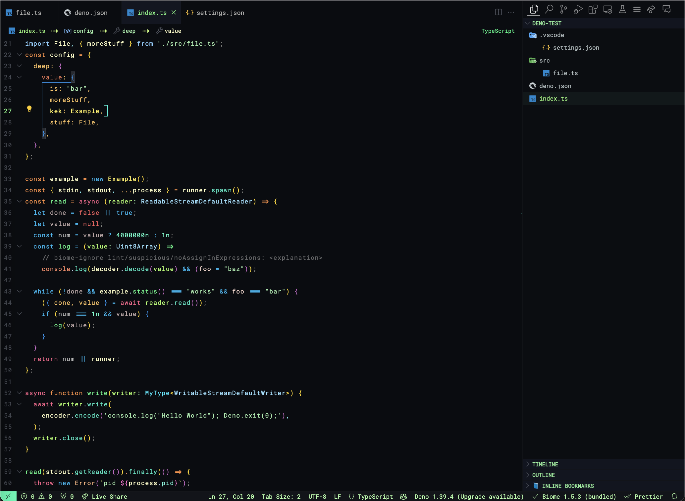
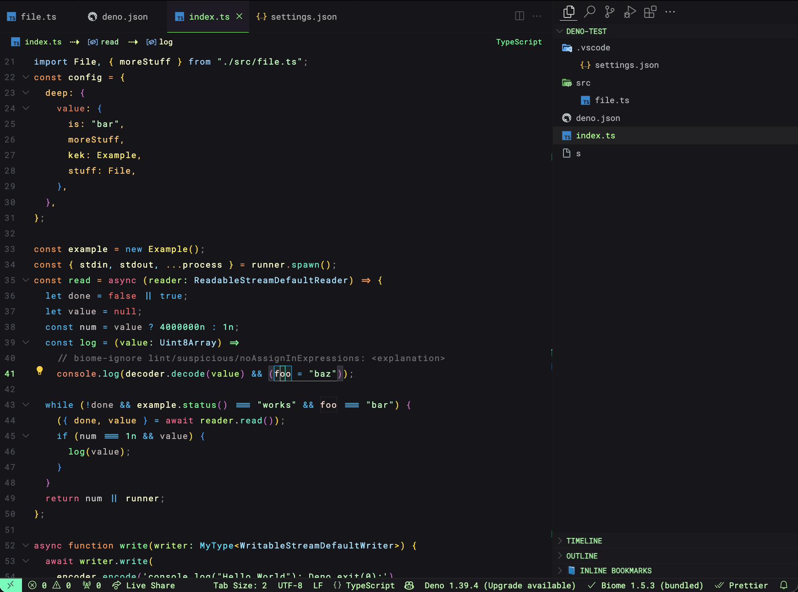

# overload vscode theme

## A vibrant theme for VSCode (best with Solidity/TypeScript)

- For full Solidity semantic highlighting you need [vsc-solidity](https://marketplace.visualstudio.com/items?itemName=0xp.vsc-solidity)
- For extended font overrides and breadcrumbs customization this uses [Apc Customize UI++](https://marketplace.visualstudio.com/items?itemName=drcika.apc-extension)

### Default Colors



### Alt Colors



### APC Extension Setup

**NOTE!**
_There is an issue in latest VSCode and the APC extension where it breaks using extensions tab_
_Just toggle `Disable APC Extension` when you need to install some extensions_

- [Ubuntu Mono & Roboto Mono](https://github.com/lemeb/a-better-ligaturizer/tree/master/output-fonts) are the default fonts, just replace with whatever you like.

- You probably need to explicitly -> CMD + SHIFT + P -> `Enable APC extension` after adding the APC configuration

_settings.json_

```json
{
	"apc.stylesheet": {
		".monaco-scrollable-element.modified-in-monaco-diff-editor.vs": "display: none;",
		".monaco-editor .insert-sign": "color: #81ff89; opacity: 1 !important; font-weight: 700; margin-left: 3px;",
		".monaco-editor .delete-sign": "color: red; opacity: 1 !important; font-weight: bold;",
		".monaco-breadcrumbs": "font-size: 11px; letter-spacing: 0.2px; font-family: 'Roboto Mono'; font-weight: 400;",
		".breadcrumbs-below-tabs": "display: flex; height: 27px; align-items: center; justify-content: center;",
		".monaco-breadcrumb-item + .outline-element:has(.outline-element-label) > *": "position: absolute; right: 15px; color: #12ff89 !important;",
		".monaco-breadcrumb-item + .outline-element:has(.outline-element-label) > .codicon": "display: none;",
		".monaco-breadcrumb-item:has([class*='-file']) > :first-of-type": "color: #98ff7c !important; ",
		".monaco-breadcrumb-item:not(:has([class*='-file'])) > .codicon:last-child:before": "display:flex; align-items: flex-start; justify-items: flex-start; content: '/'; margin: 0 1px 0 1px; font-size: 16px; height: 18px; color: #95aeb4;",
		".monaco-breadcrumb-item:has(.codicon[class*='codicon-symbol'])": "color: #A1F4AD !important;",
		".monaco-breadcrumb-item:has(.codicon[class*='codicon-symbol']):last-of-type": "color: #FFFFC6 !important;",
		".monaco-breadcrumb-item:has(.codicon[class*='codicon-symbol']):before": "margin: 0 9px 0 9px; min-width: 20px; margin-top: 1.5px; height:25px !important; !important; display: flex; align-items: flex-start; content: '⇢'; font-size: 17px; color: #CBff7b !important;",
		".monaco-breadcrumb-item:has([class*='codicon-symbol']) > .codicon:last-child:before": "content: ''; #ebff7b !important;",
		".monaco-breadcrumb-item:has([class*='-file']) .codicon:last-child:before": "content: ' ';"
	},
	"apc.header": {
		"default": 48,
		"fontSize": 12.6
	},
	"apc.listRow": {
		"height": 26,
		"fontSize": 12.1,
		"lists": [
			"customview-tree",
			"results",
			"open-editors",
			"quick-input-list",
			"explorer-folders-view",
			"outline-tree",
			"scm-view",
			"debug-view-content",
			"debug-breakpoints",
			"tree"
		]
	},
	"apc.font.family": "Ubuntu Mono",
	"apc.monospace.font.family": "Ubuntu Mono",
	"apc.parts.font.family": {
		"sidebar": "Roboto Mono",
		"titlebar": "Roboto Mono",
		"activityBar": "Roboto Mono",
		"panel": "Roboto Mono",
		"widget": "Roboto Mono",
		"tabs": "Roboto Mono",
		"auxiliarybar": "Roboto Mono",
		"banner": "Roboto Mono",
		"statusbar": "Roboto Mono",
		"settings-body": "Roboto Mono",
		"extension-editor": "Roboto Mono",
		"monaco-menu": "Roboto Mono"
	},
	"editor.fontFamily": "Ubuntu Mono, Roboto Mono, Input Mono, Verdana",
	"workbench.fontAliasing": "auto",
	"editor.inlineSuggest.fontFamily": "Ubuntu Mono",
	"editor.codeLensFontFamily": "Ubuntu Mono",
	"terminal.integrated.fontFamily": "Roboto Mono",
	"scm.inputFontFamily": "Roboto Mono",
	"editor.fontSize": 13.6,
	"editor.suggestFontSize": 13,
	"editor.codeLensFontSize": 11,
	"editor.letterSpacing": 0.9,
	"editor.lineHeight": 1.8,
	"editor.fontWeight": 400,
	"editor.fontLigatures": true,
	"window.zoomLevel": -1.45,
	"workbench.tree.indent": 26,
	"workbench.tree.renderIndentGuides": "none",
	"editor.defaultColorDecorators": true,
	"editor.guides.bracketPairs": "active",
	"editor.bracketPairColorization.independentColorPoolPerBracketType": true,
	"editor.guides.highlightActiveIndentation": "always",
	"editor.colorDecorators": true,
	"editor.renderWhitespace": "none",
	"editor.minimap.renderCharacters": false,
	"editor.minimap.enabled": false,
	"editor.glyphMargin": false,
	"editor.stickyScroll.enabled": true,
	"editor.showFoldingControls": "always",
	"diffEditor.renderIndicators": true,
	"breadcrumbs.icons": true,
	"workbench.iconTheme": "material-icon-theme"
}
```
