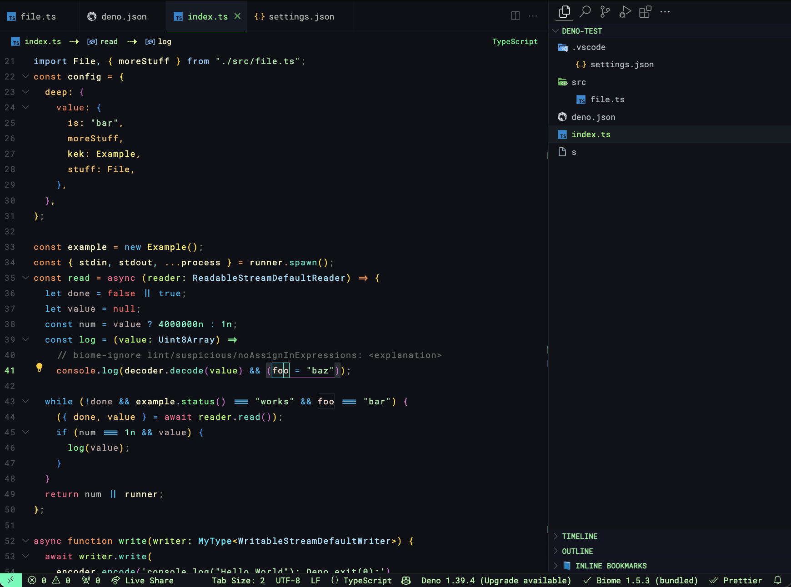

# overload vscode theme

## A vibrant theme for VSCode (best with Solidity/TypeScript)



### configuration required

* Use whatever font,  is default.

* CMD + SHIFT + P -> Enable APC extension after adding the APC configuration

_settings.json_
```json
{
  "editor.tokenColorCustomizations": {
		"[*]": {
			"textMateRules": [
				{
					"scope": ["variable"],
					"settings": {
						"foreground": "none",
						"fontStyle": "none"
					}
				},
				{
					"scope": ["entity.name.function"],
					"settings": {
						"foreground": "none",
						"fontStyle": "none"
					}
				}
			]
		}
  },
  "apc.stylesheet": {
        ".monaco-scrollable-element.modified-in-monaco-diff-editor.vs": "display: none;",
        ".monaco-editor .insert-sign": "color: #81ff89; opacity: 1 !important; font-weight: 700; margin-left: 3px;",
        ".monaco-editor .delete-sign": "color: red; opacity: 1 !important; font-weight: bold;",
        ".monaco-breadcrumbs": "font-size: 11.2px; letter-spacing: 0.6px; font-family: 'Roboto Mono';",
        ".breadcrumbs-below-tabs": "display: flex; height: 27px; align-items: center; justify-content: center;",
        ".monaco-breadcrumb-item:has([class*='-file']) > :first-of-type": "color: #98ff7c !important; ",
        ".monaco-breadcrumb-item:not(:has([class*='-file'])) > .codicon:last-child:before": "display:flex; align-items: flex-start; justify-items: flex-start; content: '/'; margin: 0 1px 0 1px; font-size: 15.5px; height: 18px; color: #95aeb4;",
        ".monaco-breadcrumb-item:has(.codicon[class*='codicon-symbol'])": "color: #A1F4AD !important;",
        ".monaco-breadcrumb-item:has(.codicon[class*='codicon-symbol']):last-of-type": "color: #FFFFC6 !important;",
        ".monaco-breadcrumb-item:has(.codicon[class*='codicon-symbol']):before": "margin: 0 9px 0 9px; min-width: 20px; margin-top: 1.5px; height:25px !important; !important; display: flex; align-items: flex-start; content: '⇢'; font-size: 17px; color: #CBff7b !important;",
        ".monaco-breadcrumb-item:has([class*='codicon-symbol']) > .codicon:last-child:before": "content: ''; #ebff7b !important;",
        ".monaco-breadcrumb-item:has([class*='-file']) .codicon:last-child:before": "content: ' ';"
      },
      "apc.header": {
        "default": 48,
        "fontSize": 12.5
      },
      "apc.listRow": {
        "height": 26,
        "fontSize": 12.1,
        "lists": [
          "customview-tree",
          "results",
          "open-editors",
          "quick-input-list",
          "explorer-folders-view",
          "outline-tree",
          "scm-view",
          "debug-view-content",
          "debug-breakpoints",
          "tree"
        ]
      },
      "apc.font.family": "Roboto Mono",
      "apc.monospace.font.family": "Roboto Mono",
      "apc.parts.font.family": {
        "sidebar": "Roboto Mono",
        "titlebar": "Roboto Mono",
        "activityBar": "Roboto Mono",
        "panel": "Roboto Mono",
        "widget": "Roboto Mono",
        "tabs": "Roboto Mono",
        "auxiliarybar": "Roboto Mono",
        "banner": "Roboto Mono",
        "statusbar": "Roboto Mono",
        "settings-body": "Roboto Mono",
        "extension-editor": "Roboto Mono",
        "monaco-menu": "Roboto Mono"
      },
      "window.zoomLevel": -1.65,
      "workbench.tree.indent": 28,
      "workbench.fontAliasing": "default",
      "scm.inputFontFamily": "Roboto Mono",
      "editor.fontFamily": "Roboto Mono, Jetbrains Mono, 'Input Mono', Verdana",
      "editor.inlineSuggest.fontFamily": "Roboto Mono",
      "editor.codeLensFontFamily": "Roboto Mono",
      "editor.defaultColorDecorators": true,
      "editor.guides.bracketPairs": "active",
      "editor.bracketPairColorization.independentColorPoolPerBracketType": true,
      "editor.guides.highlightActiveIndentation": "always",
      "editor.colorDecorators": true,
      "editor.renderWhitespace": "none",
      "editor.minimap.renderCharacters": false,
      "editor.minimap.enabled": false,
      "editor.glyphMargin": false,
      "editor.stickyScroll.enabled": true,
      "editor.showFoldingControls": "always",
      "diffEditor.renderIndicators": true,
      "window.density.editorTabHeight": "default",
      "breadcrumbs.icons": true
    }
}
```
